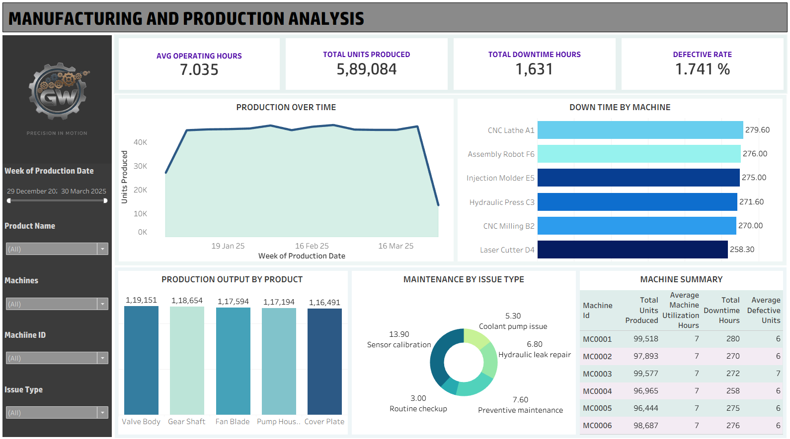

#  Manufacturing & Production Dashboard – Tableau

##  Project Overview  
This project showcases a **Manufacturing Production Dashboard** built using **Tableau Desktop** with data integrated from **MySQL** and **CSV** sources.  
The dashboard provides a clear view of **production efficiency, downtime, and maintenance performance**, enabling quick insights into operational trends and improvement areas.

---

##  Project Workflow  

1. **Data Generation (Python)**  
   - Synthetic manufacturing data was generated using Python’s randomization techniques.  
   - Data includes production logs, machine utilization, downtime hours, and maintenance issues.  

2. **Database Creation (MySQL)**  
   - Designed relational tables: `machines`, `products`, `production_log`, and `maintenance_log`.  
   - Inserted generated data into MySQL tables and validated relationships using foreign keys.  
   - Exported the `maintenance_log` as a CSV for use in Tableau blending.  

3. **Visualization (Tableau)**  
   - Connected Tableau directly to the MySQL database.  
   - Built a modern, interactive dashboard showing KPIs, production trends, and maintenance insights.  

##  Data Sources
| Source Type | Name | Description |
|--------------|------|--------------|
| MySQL | `production_log`, `machines`, `products` | Contains machine-level production and operational data |
| CSV | `maintenance_log.csv` | Contains additional maintenance and issue-type information not stored in SQL tables |

> Data from MySQL and CSV are **blended using `Machine ID`** as the common key.

---

##  Dashboard Objectives
- Track **daily and weekly production trends**
- Analyze **downtime causes and frequency**
- Identify **machines with high downtime**
- Visualize **maintenance activity by issue type**
- Provide a summarized **machine-level performance overview**

---

##  Key Performance Indicators (KPIs)
| KPI | Description |
|------|-------------|
| **Total Units Produced** | 589,084 |
| **Average Operating Hours** | 7 hours |
| **Total Downtime Hours** | 1,631 hours |
| **Defect Rate** | 1.74% |

---

##  Visualizations

### 1. **Production Trend Over Time (Area + Line)**
- **Purpose:** Shows weekly production with downtime overlay.  
- **Insight:** Reveals consistency and any sharp dips in production volume.

### 2. **Downtime by Machine**
- **Purpose:** Highlights top machines contributing to total downtime.  
- **Insight:** Pinpoints which machines need maintenance priority.

### 3. **Production Output by Product**
- **Purpose:** Compares total units produced across different products.  
- **Insight:** Identifies high-performing and low-volume products.

### 4. **Maintenance by Issue Type**
- **Purpose:** Displays the distribution of maintenance issues.  
- **Insight:** Preventive maintenance and sensor calibration are the most frequent issues.

### 5. **Machine Summary Table**
- **Purpose:** To show a compact performance summary.  
- **Columns:** Machine ID, Total Units Produced, Avg. Machine Utilization, Downtime, Defective Units.  
- **Insight:** Offers a concise operational overview for each machine.

---

## 🔗 Relationships & Data Blending
- **MySQL** tables joined on `Machine ID` and `Product ID`.  
- **CSV (Maintenance Log)** blended via `Machine ID` for combined analysis.  
- Dashboard created using **Extracts** for performance optimization.

---

##  Tools & Technologies
- **Tableau Desktop** – Visualization & Data Blending  
- **MySQL** – Primary production database  
- **CSV (Excel)** – Supplementary maintenance data  
- **GitHub** – Project documentation and sharing  

---

##  Dashboard Preview

---

##  Insights Summary
- Week-level trend visualization revealed a **production dip during the last week** of the dataset.  
- Most downtime is concentrated in a few machines.  
- Preventive maintenance and calibration are recurring issue types.  
- Product output distribution indicates **balanced utilization of resources**.

